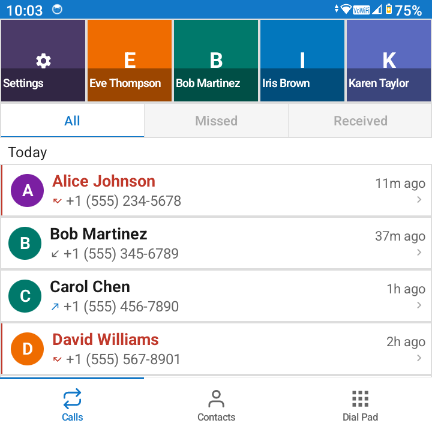
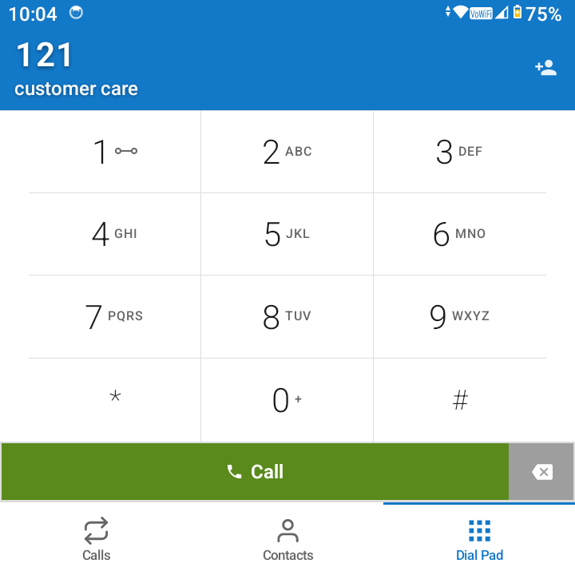
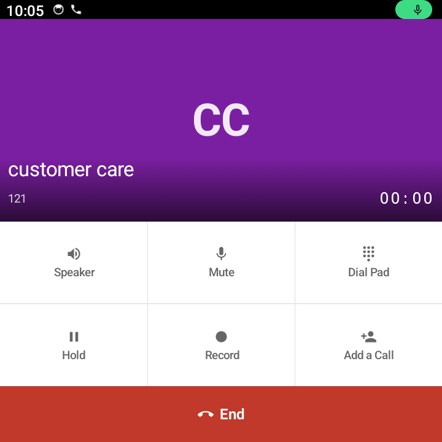

# Zeno Classic Dialer

Native Android dialer focused on **square, keyboard-first phones**—especially the **Zinwa Q25** (720×720, physical QWERTY and call keys). It is designed to be the **default phone app** (`ROLE_DIALER`) and works best with **BlackBerry-style hardware** (call/end, convenience keys). Behavior on slab phones may differ.

**Not regularly tested on:** Unihertz Titan / Titan Elite (similar form factors may work but are unverified).

---

## Screenshots

| Calls | Dial pad | In-call |
|-------|----------|---------|
|  |  |  |

*Sample UI; names and numbers are illustrative.*

---

## Releases

[](https://github.com/faisal-ops/zeno-classic-dialer/releases)
[](https://github.com/faisal-ops/zeno-classic-dialer/releases/latest)

**Install:** open **[Latest release](https://github.com/faisal-ops/zeno-classic-dialer/releases/latest)** and download the attached APK (e.g. `zeno-classic-dialer-v2.0.1.apk` for **v2.0.1**).  
All releases: [github.com/faisal-ops/zeno-classic-dialer/releases](https://github.com/faisal-ops/zeno-classic-dialer/releases).

---

## Features

- **Three main tabs** — **Calls** (favorites + call log with All / Missed / Received), **Contacts**, **Dial Pad**
- **Adaptive dialpad** — Layout tuned for square screens; long-press the number field for **paste / copy**
- **Haptic feedback** — Light vibration on key presses where supported
- **Inline call details** — Expand call log rows for quick actions
- **Bottom sheet actions** — Long-press contacts/recents for edit, block, copy number, history, etc.
- **Hardware keys** — Physical call/end, D-pad, QWERTY-to-digit mapping on the dial pad
- **Optional AccessibilityService** — Intercepts toolbar Call/End on some devices when the user enables it (`ButtonInterceptService`)
- **Voice search** — Speech-to-text for contact search
- **Blocked numbers** — Screening and block list (where the platform allows)
- **In-call controls** — Speaker, mute, dial pad, hold, optional recording (microphone permission), add call

## Technical details

| Item | Value |
|------|--------|
| **Language** | Kotlin |
| **UI** | Jetpack Compose + Material 3 |
| **`applicationId`** | `com.zeno.zenoclassicdialer` (release). Debug builds use the `.debug` suffix. |
| **Version** | **2.0.1** (`versionCode` **15**); debug APK shows `2.0.1-debug` via `versionNameSuffix` |
| **Min SDK** | **29** (Android 10) — default dialer / Telecom stack |
| **Target SDK** | 34 |
| **Theme** | Three selectable styles: **Original Classic**, **Modern Classic**, **Pixel** |

## Permissions (high level)

| Permission | Purpose |
|------------|---------|
| `READ_CALL_LOG` / `WRITE_CALL_LOG` | Call history |
| `READ_CONTACTS` | Names and search |
| `CALL_PHONE` | Place calls |
| `READ_PHONE_STATE` | Call state / SIM info where used |
| `ANSWER_PHONE_CALLS` | Answer from the app when appropriate |
| `MANAGE_OWN_CALLS` | In-call control as default dialer |
| `BIND_INCALL_SERVICE` | Active call UI / audio route |
| `BIND_SCREENING_SERVICE` | Incoming call screening |
| `POST_NOTIFICATIONS` | Call notifications (Android 13+) |
| `RECORD_AUDIO` | Optional in-call recording |
| `SEND_SMS` | Quick-reply SMS from incoming UI |
| `READ_BLOCKED_NUMBERS` / `WRITE_BLOCKED_NUMBERS` | Block list |
| `USE_FULL_SCREEN_INTENT` | Full-screen incoming call on some devices |
| `FOREGROUND_SERVICE` | Ongoing call notification / services |
| `VIBRATE` | Haptics / notification vibration |

Exact usage is defined in `AndroidManifest.xml` and runtime permission flows in the app.

## Build

### Debug

```bash
./gradlew assembleDebug
```

APK: `app/build/outputs/apk/debug/app-debug.apk` (installs as `com.zeno.zenoclassicdialer.debug`).

### Release (signed)

1. Add `keystore.properties` (see `keystore.properties.example`). **Never commit** keystores or passwords.
2. Build:

```bash
./gradlew assembleRelease
```

APK: `app/build/outputs/apk/release/zeno-classic-dialer-v2.0.1.apk`

```bash
adb install -r app/build/outputs/apk/release/zeno-classic-dialer-v2.0.1.apk
```

## Tested devices

| Device | Display | Notes |
|--------|---------|--------|
| **Zinwa Q25** | 720×720 | Primary target |

## Contributing

Issues and pull requests are welcome. Follow **[AGENTS.md](docs/AGENTS.md)** for JDK, release builds, and device install expectations when changing code.
